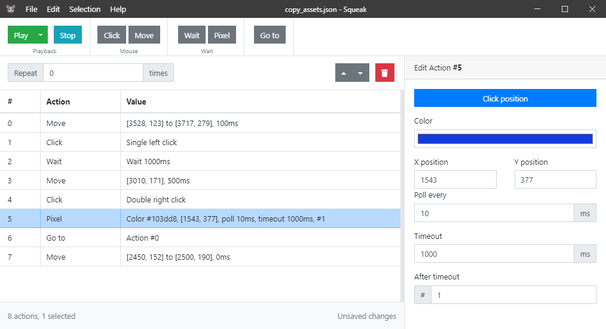

<br>

> An open-source mouse recorder and desktop automation software.

Squeak is an electron app for desktop automation, including controlling the mouse, keyboard input, waiting for a period of time or until a pixel changes colour and more.

In theory, Squeak is built for **Windows, Linux and Mac**; behind the scenes, Squeak uses [robotjs](https://github.com/octalmage/robotjs) and [iohook](https://github.com/wilix-team/iohook).

<br>



## Roadmap

If you have any feature requests, please create an issue and I will add it to the roadmap. Or you could make a pull request!

- [ ] Keyboard output (raw keystrokes)
- [ ] Text output (arbitrary string with randomness)
- [ ] Scroll output
- [ ] Abstract actions into single file modules
- [ ] Multiple monitor support
- [ ] Recent files
- [ ] Wait for image on screen
- [ ] Playback speed
- [ ] Record input from mouse and keyboard
- [ ] Switching applications
- [ ] Hotkeys e.g. for cancelling playback
- [ ] Some tests would be good!

## Development

``` bash
# Install dependencies
npm install

# Serve with hot reload at localhost:9080
npm run dev

# Build electron application for production
npm run build

# Lint all JS/Vue component files in `src/`
npm run lint
```

---

This project was generated with [electron-vue](https://github.com/SimulatedGREG/electron-vue) using [vue-cli](https://github.com/vuejs/vue-cli). Documentation about the original structure can be found [here](https://simulatedgreg.gitbooks.io/electron-vue/content/index.html).
